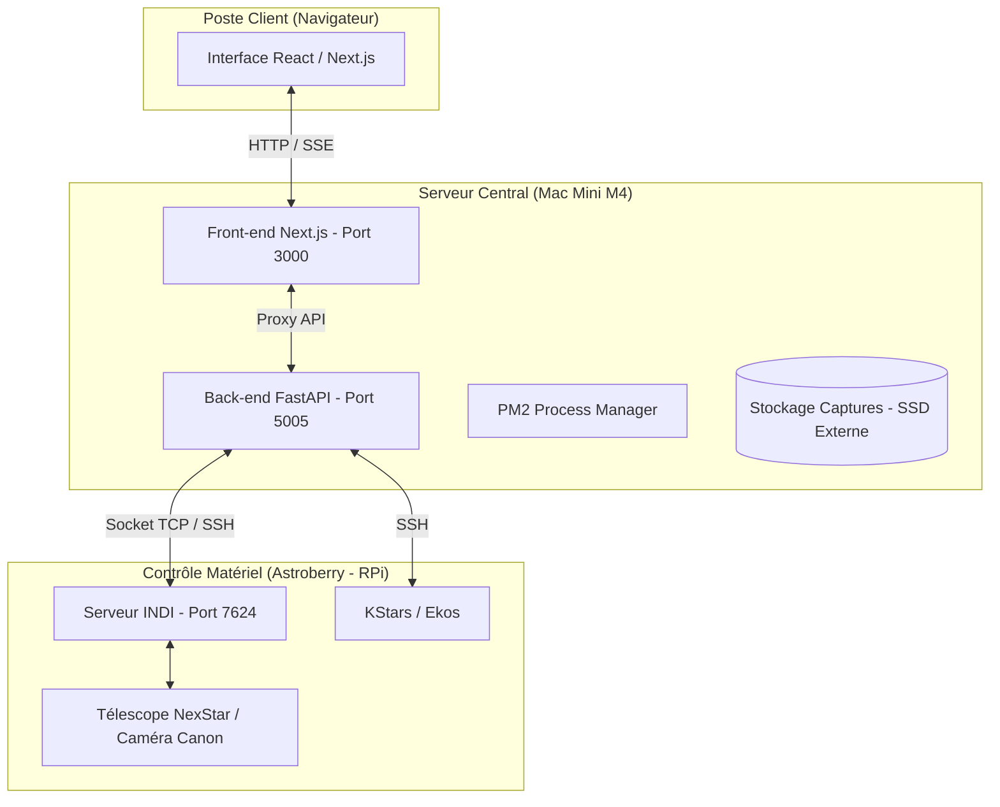

# 🔭 Stargazer - Dossier d'Architecture Technique (DAT)

Ce document détaille l'architecture, le déploiement et les procédures d'exploitation de la plateforme **Stargazer**, une interface de contrôle unifiée pour observatoire astronomique (Astroberry / NexStar).

---

## 1. Vue d'ensemble et Objectifs
Stargazer permet le pilotage à distance d'un télescope et d'une caméra via une interface web moderne. Elle agit comme une passerelle (bridge) entre l'utilisateur final et les protocoles bas niveau de l'astronomie (INDI).

---

## 2. Infrastructure & Architecture

### 2.1 Schéma de l'Infrastructure


### 2.2 Composants Techniques
- **Front-end** : Next.js 14 (React), Chakra UI, Framer Motion. Gère l'affichage, l'état global (Zustand) et le proxy vers le backend.
- **Back-end** : FastAPI (Python 3). Gère la communication socket avec le serveur INDI, le traitement d'images (Astropy, Rawpy) et l'accès au système de fichiers.
- **Bridge INDI** : Le backend communique directement avec un Raspberry Pi (Astroberry) distant via le protocole INDI.

---

## 3. Déploiement

### 3.1 Pré-requis
- **Runtime** : Node.js 20+, Python 3.11+.
- **Processus** : PM2 installé globalement (`npm install -g pm2`).
- **Accès** : SSH configuré vers le Mac Mini et l'Astroberry.

### 3.2 Procédure Manuelle
Un script de déploiement automatique est disponible :
```bash
./deploy.sh      # Build complet + Redémarrage des services
./deploy.sh fast # Synchronisation + Redémarrage backend uniquement
```

Le script utilise `rsync` pour synchroniser les fichiers et `ssh` pour exécuter les commandes distantes.

---

## 4. CI/CD (GitHub Actions)

Le projet utilise un workflow GitHub Actions (`.github/workflows/deploy.yml`) configuré sur un **GitHub Runner self-hosted** (Mac Mini M4).

### Étapes du pipeline :
1. **Pull** : Récupération du dernier code depuis `main`.
2. **Build Front** : `npm ci` puis `npm run build` (génération des fichiers statiques Next.js).
3. **Setup Back** : Création/mise à jour du `venv` Python et installation des dépendances via `pip`.
4. **Restart** : Suppression des anciens processus PM2 et démarrage via `ecosystem.config.js`.
5. **Health Check** : Vérification de la disponibilité du backend (Port 5005) et du frontend (Port 3000).

---

## 5. Exploitation & Maintenance

### 5.1 Gestion des processus (PM2)
La plateforme est supervisée par PM2. Le fichier de configuration est `ecosystem.config.js`.

**Commandes utiles :**
```bash
pm2 list             # Voir l'état des services
pm2 logs             # Voir les logs en temps réel
pm2 restart all      # Redémarrer tout
pm2 show stargazer-backend # Détails du backend
```

### 5.2 Logs

Les logs sont centralisés dans le dossier `logs/` à la racine :

- `logs/frontend-out.log` / `logs/frontend-error.log`
- `logs/backend-out.log` / `logs/backend-error.log`

### 5.3 Maintenance Matérielle

- **Stockage** : Les captures sont stockées sur `/Volumes/Data2/captures`. En cas d'absence du disque, le système bascule sur le stockage local.
- **Connectivité** : Si le serveur INDI est inaccessible, utiliser le bouton "RECONNECT" dans l'interface pour réinitialiser les sockets TCP.

---

## 6. Configuration
- **Backend (.env)** : `ASTROBERRY_HOST`, `STORAGE_PATH`, `INDI_PORT`.
- **Frontend (Next.js)** : Les routes API proxifient automatiquement les appels vers `http://127.0.0.1:5005`.

---

## 7. Résilience & État du Matériel (Stabilisation)

Le système a été renforcé pour garantir une remontée d'état fiable et une résilience aux erreurs réseau.

### 7.1 Détection des Périphériques
Le backend (`main.py`) ne se contente plus de vérifier la connexion socket. Il monitore activement la propriété `CONNECTION` de chaque périphérique INDI :
- **Mount** : `Celestron GPS`
- **Caméra** : `Canon DSLR EOS 600D`
L'interface affiche ainsi séparément l'état du pont (bridge) et l'état réel de connexion physique des appareils.

### 7.2 Résilience des API
- **Proxy Next.js** : Toutes les routes API dans `src/app/api` sont protégées contre les corps de requête vides et les réponses non-JSON du backend.
- **Backend FastAPI** : Le serveur utilise un système de verrouillage (`threading.Lock`) sur les sockets INDI pour éviter les corruptions de paquets lors d'accès concurrents.

### 7.3 Troubleshooting Courant

| Problème | Cause Probable | Solution |
| :--- | :--- | :--- |
| `Unexpected end of JSON` | Crash du backend ou corps vide | Vérifier `pm2 logs stargazer-backend` |
| `INDI Bridge DOWN` | Socket TCP fermé | Cliquer sur "RECONNECT" dans l'interface |
| `SSH Unreachable` | RPi éteint ou changement d'IP | Vérifier `ASTROBERRY_HOST` dans `server/.env` |
| `Mount IDLE` permanent | Ekos non lancé | Vérifier l'état de KStars dans l'onglet Infrastructure |
